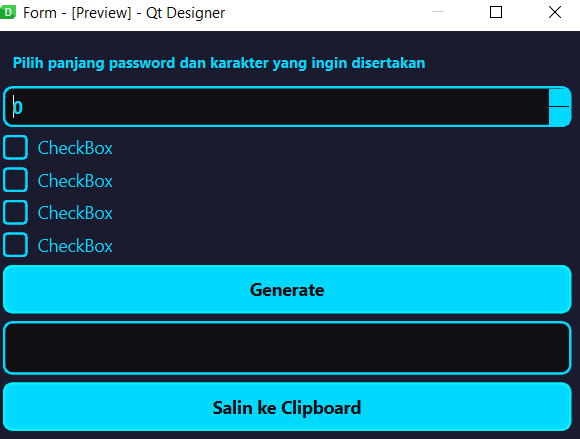

### Password Generator
With this program, you can generate a password with various options, such as passwords using lowercase letters, uppercase letters, symbols, numbers or combining all of them.

### Tools
- PyQt6
- Visual Studio Code
- python3.10.11
- ChaGPT

### Display of the program

### Instruction
1. Select your option by ticking the checkbox
2. Click Generate
3. If you want to copy the password that has been generated, click on the copy to clipboard section.